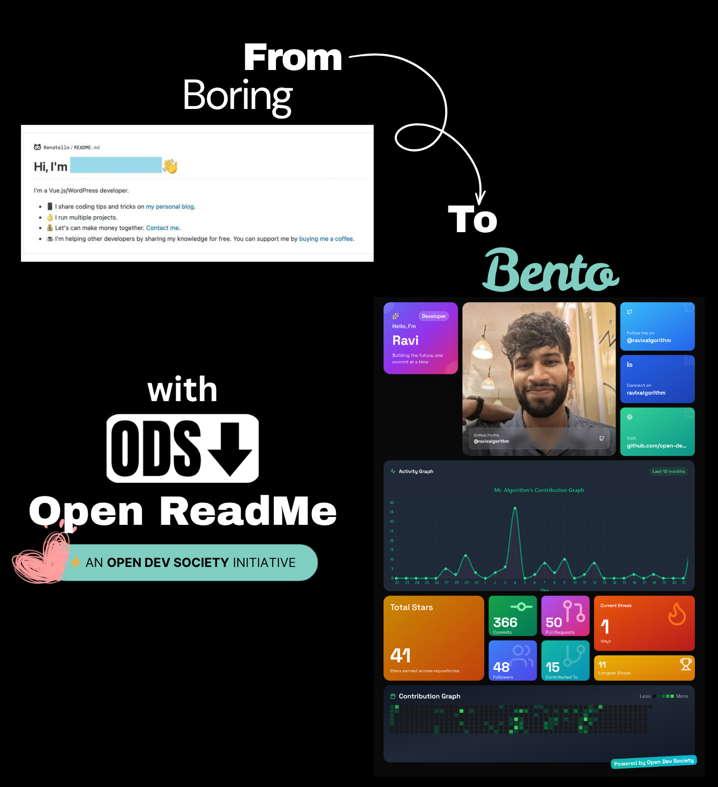

<div align="center">
  <br />
  <a href="#" target="_blank">
    
  </a>
  
  <br />
  © Open Dev Society. This project is licensed under AGPL-3.0; if you modify, redistribute, or deploy it (including as a web service), you must release your source code under the same license and credit the original authors.
  <br/>

  <div>
    
    
    
    
    
    
    
  </div>
</div>

# OpenReadme

OpenReadme is a modern, open-source GitHub profile README generator that creates beautiful, auto-updating profile banners with customizable bento-style grids. Built with Next.js and serverless technology for seamless profile customization.

Note: OpenReadme is a community-built tool for generating GitHub profile READMEs. Generated images are cached and may be updated based on your configuration and GitHub activity.

## 📋 Table of Contents

1. ✨ [Introduction](#introduction)
2. 🌍 [Open Dev Society Manifesto](#manifesto)
3. ⚙️ [Tech Stack](#tech-stack)
4. 🔋 [Features](#features)
5. 🤸 [Quick Start](#quick-start)
6. 🐳 [Docker Setup](#docker-setup)
7. 🔐 [Environment Variables](#environment-variables)
8. 🧱 [Project Structure](#project-structure)
9. 📡 [API & Integrations](#api--integrations)
10. 🧪 [Scripts & Tooling](#scripts--tooling)
11. 🤝 [Contributing](#contributing)
12. 🛡️ [Security](#security)
13. 📜 [License](#license)
14. 🙏 [Acknowledgements](#acknowledgements)

## ✨ Introduction

OpenReadme is a cutting-edge GitHub profile README generator powered by Next.js (App Router), Tailwind CSS, and serverless Chromium for dynamic image generation. Create stunning, auto-updating profile banners with personalized bento-style layouts that showcase your GitHub activity, social links, and professional information.

## 🌍 Open Dev Society Manifesto <a name="manifesto"></a>

We live in a world where knowledge is hidden behind paywalls. Where tools are locked in subscriptions. Where information is twisted by bias. Where newcomers are told they're not "good enough" to access resources.

We believe there's a better way.

- **Our Belief**: Technology should belong to everyone. Knowledge should be open, free, and accessible. Communities should welcome newcomers with trust, not gatekeeping.
- **Our Mission**: Build free, open-source projects that make a real difference:
    - Tools that professionals and students can use without barriers.
    - Knowledge platforms where learning is free, forever.
    - Communities where every beginner is guided, not judged.
    - Resources that run on trust, not profit.
- **Our Promise**: We will never lock knowledge. We will never charge for access. We will never trade trust for money. We run on transparency, donations, and the strength of our community.
- **Our Call**: If you've ever felt you didn't belong, struggled to find free resources, or wanted to build something meaningful — you belong here.

Because the future belongs to those who build it openly.

## ⚙️ Tech Stack

**Core**
- Next.js 15 (App Router), React 19
- TypeScript
- Tailwind CSS
- Puppeteer + Chromium (serverless)

**UI & Animation**
- Framer Motion
- Lucide React icons
- Custom bento-style grid components
- Responsive design system

**Automation & Integration**
- GitHub Actions workflows
- GitHub API integration
- Serverless image generation
- Auto-updating profile images

**Language Composition**
- TypeScript (~85%), JavaScript (~10%), CSS (~5%)

## 🔋 Features

- **🎨 Profile Generation**
    - Beautiful bento-style grid layouts
    - Customizable profile information display
    - Social media integration (GitHub, Twitter, LinkedIn)
    - Portfolio and website links

- **🔄 Auto-Updates**
    - GitHub Actions workflow generation
    - Scheduled profile image updates
    - Real-time GitHub stats integration
    - Automatic cache invalidation

- **⚡ One-Click Setup**
    - Downloadable workflow files
    - Pre-configured GitHub Actions
    - Easy repository integration
    - No manual configuration required

- **🌐 API-First Design**
    - RESTful image generation API
    - Query parameter customization
    - Serverless architecture
    - Optimized image delivery

- **📱 Modern UI**
    - Responsive design
    - Dark theme optimized
    - Smooth animations
    - Intuitive user experience

- **🔧 Developer Experience**
    - TypeScript support
    - ESLint configuration
    - Hot reload development
    - Production-ready builds

## 🤸 Quick Start

**Prerequisites**
- Node.js 18+
- GitHub personal access token (repo read permissions)
- Git for version control

**Clone and Install**
```bash
git clone https://github.com/Open-Dev-Society/openreadme.git
cd openreadme

# Choose your package manager
npm install
# or
yarn install
# or
pnpm install
```

**Configure Environment**
- Create a `.env.local` file (see [Environment Variables](#environment-variables))
- Generate GitHub personal access token

**Run Development**
```bash
npm run dev
# or
yarn dev
# or
pnpm dev
```

**Build & Start (Production)**
```bash
npm run build && npm start
# or
yarn build && yarn start
# or
pnpm build && pnpm start
```

Open http://localhost:3000 to start creating your OpenReadme!

## 🐳 Docker Setup

Run OpenReadme easily with Docker for development and production.

**Prerequisites**
- Docker and Docker Compose installed
- Environment variables configured

**Quick Start with Docker**
```bash
# Clone the repository
git clone https://github.com/Open-Dev-Society/openreadme.git
cd openreadme

# Create your .env file
cp .env.example .env.local
# Edit .env.local with your credentials

# Build and run with Docker Compose
docker-compose up --build
```

**Access the Application**
- App: http://localhost:3000
- Environment: Containerized Next.js application

**Production Deployment**
```bash
# Build production image
docker build -t openreadme:latest .

# Run production container
docker run -p 3000:3000 --env-file .env.local openreadme:latest
```

## 🔐 Environment Variables

Create `.env.local` at the project root:

```env
# Core Configuration
NODE_ENV=development
NEXT_PUBLIC_SITE_URL=http://localhost:3000

# GitHub Integration
GITHUB_TOKEN=ghp_your_personal_access_token_here

# Optional: Local Development
CHROME_EXECUTABLE_PATH=  # Optional for local Chromium path
```

**Security Notes**
- Keep private tokens server-side when possible
- Use environment-specific configurations
- Never commit sensitive credentials to version control
- Consider using secure environment management tools

## 🧱 Project Structure

```
openreadme/
├── app/
│   ├── api/
│   │   └── openreadme/route.ts    # Image generation API
│   ├── globals.css                # Global styles
│   ├── layout.tsx                 # Root layout
│   └── page.tsx                   # Main application page
├── components/
│   ├── ui/                        # Reusable UI components
│   ├── ErrorBoundary.tsx          # Error handling
│   ├── Navbar.tsx                 # Navigation component
│   ├── Odsbranding.tsx           # Branding component
│   └── Tree.tsx                   # File tree component
├── lib/
│   ├── env.ts                     # Environment validation
│   └── utils.ts                   # Utility functions
├── public/                        # Static assets
├── types/                         # TypeScript definitions
├── scripts/                       # Build and utility scripts
├── next.config.ts                 # Next.js configuration
├── tailwind.config.ts             # Tailwind configuration
└── package.json                   # Dependencies and scripts
```

## 📡 API & Integrations

**Image Generation API**

Endpoint: `GET /api/openreadme`

Query Parameters:
- `n` - Name (string)
- `g` - GitHub username (string)
- `x` - X/Twitter handle (string, optional)
- `l` - LinkedIn username (string, optional)
- `i` - Profile image URL (string, optional)
- `p` - Portfolio/website URL (string, optional)
- `z` - Cache-buster/random ID (string)

Response:
```json
{
  "url": "https://your-domain.com/generated/openreadme/your-id.png"
}
```

Example Usage:
```bash
curl "https://openreadme.dev/api/openreadme?n=John%20Doe&g=johndoe&x=johndoe&l=johndoe&z=12345"
```

**GitHub Actions Integration**
- Auto-generated workflow files
- Scheduled updates (configurable)
- Automatic image refresh
- Repository integration

**Image Storage & Delivery**
- Optimized image generation
- Fast delivery system
- Automatic cleanup
- Version management

## 🧪 Scripts & Tooling

**Package Scripts**
- `dev`: Next.js development server
- `build`: Production build
- `start`: Production server
- `lint`: ESLint code quality check
- `type-check`: TypeScript validation

**Development Tools**
- TypeScript strict mode
- ESLint with Next.js rules
- Tailwind CSS with JIT compilation
- Hot reload for rapid development

**Build & Deployment**
- Next.js optimization
- Static asset optimization
- Environment-aware builds
- Docker containerization

## 🤝 Contributing

You belong here. Whether you're a student, a self-taught developer, or a seasoned engineer — contributions are welcome.

**Getting Started**
1. Fork the repository
2. Create a feature branch (`git checkout -b feature/amazing-feature`)
3. Make your changes
4. Run tests and linting
5. Commit your changes (`git commit -m 'Add amazing feature'`)
6. Push to the branch (`git push origin feature/amazing-feature`)
7. Open a Pull Request

**Contribution Guidelines**
- Open an issue to discuss ideas and bugs
- Look for "good first issue" or "help wanted" labels
- Keep PRs focused and well-documented
- Add screenshots for UI changes
- Be kind, guide beginners, no gatekeeping — that's the ODS way

**Development Setup**
```bash
# Fork and clone your fork
git clone https://github.com/your-username/openreadme.git
cd openreadme

# Install dependencies
npm install

# Create feature branch
git checkout -b feature/your-feature

# Make changes and test
npm run dev
npm run lint
npm run type-check

# Commit and push
git add .
git commit -m "Your descriptive commit message"
git push origin feature/your-feature
```

## 🛡️ Security

**Reporting Vulnerabilities**

If you discover a security vulnerability:
- Do not open a public issue
- Email: opendevsociety@cc.cc
- We'll coordinate responsible disclosure and patch swiftly

**Security Measures**
- Environment variable validation
- Input sanitization
- Rate limiting on API endpoints
- Secure image generation process

## 📜 License

OpenReadme is and will remain free and open for everyone. This project is licensed under the AGPL-3.0 License - see the LICENSE file for details.

## 🙏 Acknowledgements

- Next.js team for the incredible React framework
- Puppeteer for serverless browser automation
- Tailwind CSS for utility-first styling
- Framer Motion for smooth animations
- GitHub for hosting and Actions integration
- Open Dev Society community for continuous support and contributions

— Built openly, for everyone, forever free. Open Dev Society.

## Our Honourable Contributors

- [ravixalgorithm](https://github.com/ravixalgorithm) - Core developer and project architect, built the entire application from the ground up including the profile generation system, API integration, and user interface.

## Special Thanks

Huge appreciation to the open-source community and all developers who believe in making tools accessible to everyone. Your contributions make projects like OpenReadme possible.

Special shoutout to [opbento.edgexhq.tech](https://opbento.edgexhq.tech) for the incredible inspiration and innovative ideas that sparked the creation of this amazing project. The bento-style design concept and creative approach were instrumental in shaping OpenReadme's visual identity.

<div align="center">
  <p>Made with ❤️ by <a href="https://opendevsociety.com">Open Dev Society</a></p>
  <p>
    <a href="https://github.com/Open-Dev-Society">
      
    </a>
  </p>
</div>

> © Open Dev Society. This project is licensed under AGPL-3.0; if you modify, redistribute, or deploy it (including as a web service), you must release your source code under the same license and credit the original authors.
